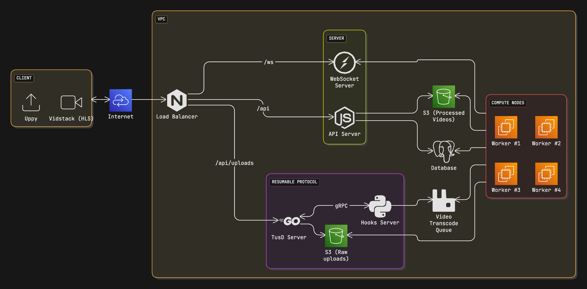

## Understanding the problem and defining scope

Short-form video has become the mainstream media now. At present, every other big company has rolled out its own version of a short video service, such as TikTok, YouTube Shorts, Instagram Reels, etc.

In this article, I am sharing my design of a video transcoding service from scratch without using any third-party SaaS such as [Mux](https://www.mux.com/), [Cloudflare Stream](https://developers.cloudflare.com/stream/), [AWS Elastic Transcoder](https://aws.amazon.com/elastictranscoder/) or [AWS Elemental MediaConvert](https://aws.amazon.com/mediaconvert/).

This system is designed primarily for early startups that are small to medium in size and have video transcoding needs.

This design should cater to the following needs:

- Ability to upload large video files, with resumable uploads
- Smooth video streaming of different video qualities
-Scalable, reliable, and low-cost infrastructure

## High Level Design

## Components
- **TUSd** - TUSd is a protocol for resumable file uploads. It allows you to resume file uploads from where it left off. It is a simple protocol that allows you to upload files in chunks. TUSd is a server implementation of the TUS protocol. It is written in Go and is easy to deploy. This is used by supabase for uploading large files.
- **Tusd gRPC Hooks Server** - This is a gRPC server which listens to tusd events and triggers the transcoding process. This is written in Python.
- **FFmpeg** - FFmpeg is a free and open-source software project consisting of a large suite of libraries and programs for handling video, audio, and other multimedia files and streams. At its core is the FFmpeg program itself, designed for command-line-based processing of video and audio files.
- **RabbitMQ** - RabbitMQ is an open-source message-broker software that originally implemented the Advanced Message Queuing Protocol and has since been extended with a plug-in architecture to support Streaming Text Oriented Messaging Protocol, MQ Telemetry Transport, and other protocols.
- **AWS S3/Minio** - Amazon S3 or Minio is an object storage service that offers industry-leading scalability, data availability, security, and performance. This means customers of all sizes and industries can use it to store and protect any amount of data for a range of use cases, such as data lakes, websites, mobile applications, backup and restore, archive, enterprise applications, IoT devices, and big data analytics.
- **HLS** - HTTP Live Streaming (also known as HLS) is an HTTP-based adaptive bitrate streaming communications protocol developed by Apple Inc. It is used to stream live or pre-recorded audio and video to mobile devices and personal computers.
- **WebSocket Server** - This is a server which listens to transcoding events and sends the transcoding progress to the client.
---

- **Vidsack** - UI components and hooks for building media players on the web. Robust, customizable, and accessible.
- **Uppy** - Uppy is a sleek, modular JavaScript file uploader that integrates seamlessly with any application. It’s fast, easy to use, and lets you worry about more important problems than building a file uploader.

## References
- [Veed](https://github.com/iamsahebgiri/veed)
- [TUSd](https://tus.io/)
- [FFmpeg](https://ffmpeg.org/)
- [Vidstack](https://vidstack.io/)
- [RabbitMQ](https://www.rabbitmq.com/)
- [AWS S3](https://aws.amazon.com/s3/)
- [Minio](https://min.io/)
- [HLS](https://en.wikipedia.org/wiki/HTTP_Live_Streaming)
- [AWS EC2](https://aws.amazon.com/ec2/)